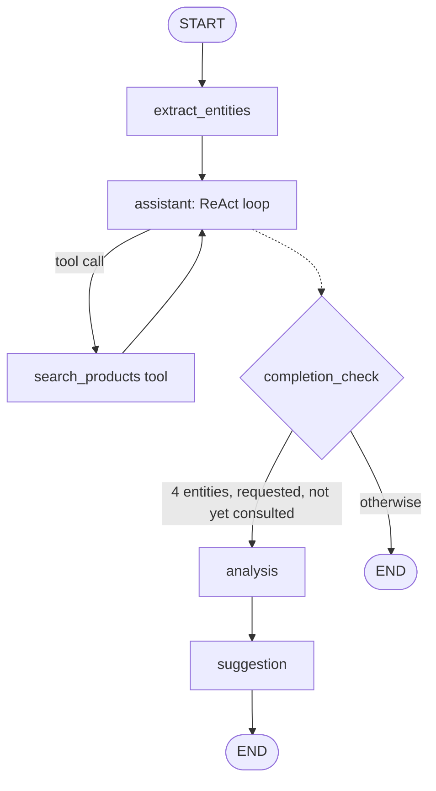
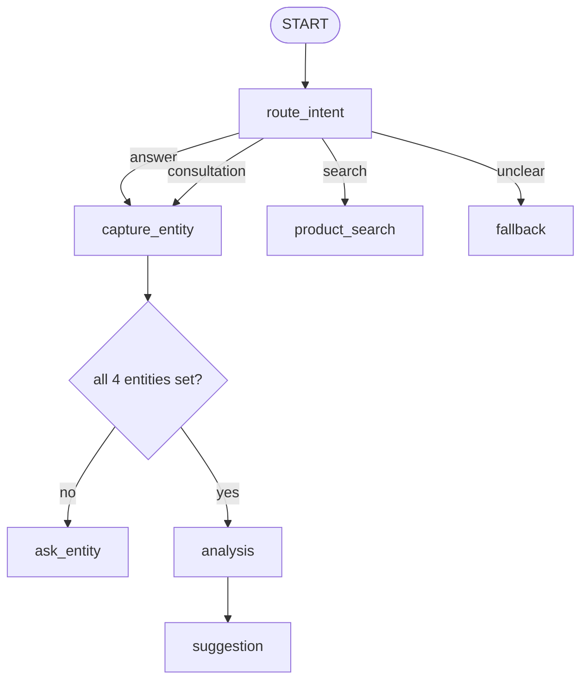

# Consultant Bot

A Persian-language chatbot for a digital-marketing store, built with LangChain and LangGraph. It
does two things:

1. **Product search** over the store's catalog (`products.json`, 29 products).
2. **Business consultation**: it collects four facts about the user's business (business type,
   customer type B2B/B2C, geographic location, and whether they have a website or page to sell
   from), then gives a free-knowledge business analysis followed by product suggestions drawn
   from the real catalog.

The original task is in [`docs/TASK_SPEC.md`](docs/TASK_SPEC.md).

The assistant is built **twice**, as two LangGraph architectures that share the same product
pipeline and search strategies. Product search likewise comes in **four interchangeable
strategies**. The goal is to compare the design choices side by side on the same scenarios,
not to argue for one of them in the abstract.

## Quick start

Requires Python 3.12+ and [uv](https://docs.astral.sh/uv/).

```bash
uv sync
cp example.env .env        # then set OPENAI_API_KEY in .env
uv run consultant-bot-web  # opens the Gradio UI, by default at http://127.0.0.1:7860
```

To run the other architecture:

```bash
uv run consultant-bot-web --arch scripted   # --arch agentic is the default
```

The web UI renders right-to-left for Persian. Each browser session gets its own conversation.
Clearing the chat starts a new one. Conversations are kept in memory only and are lost when the
process stops.

### Example conversation starters

- `مدیریت پیج اینستاگرام دارید؟` (product search: "do you offer Instagram page management?")
- `یه کافه تو تهران دارم، مشتری‌هام مردم عادی‌ان و توی اینستاگرام می‌فروشم. مشاوره می‌خوام.`
  (a consultation request that states all four facts at once: "I run a cafe in Tehran, my
  customers are ordinary people, I sell on Instagram. I'd like some advice.")
- `می‌خوام برای کسب‌وکارم مشاوره بگیرم` ("I'd like a consultation for my business"). The bot
  then asks for the facts it's missing.

## The two architectures

| | **Agentic** (`--arch agentic`) | **Scripted** (`--arch scripted`) |
|---|---|---|
| Who drives the conversation | a tool-calling LLM agent | a fixed state machine |
| Entity collection | extracted from every turn, in any order; corrections overwrite and re-run the consultation | asked one at a time in the spec's order; values already stated in the request are taken; no corrections |
| Product search | an LLM tool, with compound requests split into separate searches | the raw message passed to the search strategy, results shown as a template |
| Follow-ups, tangents, off-topic input | answered by the same agent | a canned fallback reply |
| Consultation trigger | all 4 entities known **and** the user asked for it (the bot offers once if they didn't) | the user asks for a consultation, then answers the questions |
| Suggestions | relevance floor applied; "nothing found" when nothing clears it | whatever the top-k results are |
| LLM calls | on every step | only for intent classification, analysis and suggestion write-up |
| Testability | agent behavior needs a live model | most of the graph is plain code, tested end to end on fakes |

In both variants the **analysis** and **suggestion** steps are separate LLM calls. The analysis
sees only the four entities and no product data. The suggestion runs a product search and writes
its recommendation from the retrieved results only.

Agentic graph:



Scripted graph:



Full design: [`docs/ARCHITECTURE_AGENTIC.md`](docs/ARCHITECTURE_AGENTIC.md) and
[`docs/ARCHITECTURE_SCRIPTED.md`](docs/ARCHITECTURE_SCRIPTED.md). The scripted doc's "Known
limitations" section traces the same scenarios through both designs.

## Search strategies

Select one with `CONSULTANT_BOT_SEARCH_STRATEGY` in `.env`:

| Strategy | How it works |
|---|---|
| `filter` | Phase 1: keyword/substring match over name, description and category, plus an explicit category filter |
| `tfidf` | Phase 2: scikit-learn TF-IDF with cosine similarity, category folded into the text |
| `embedding` | Phase 3: local `sentence-transformers` model (`paraphrase-multilingual-MiniLM-L12-v2`), no API calls |
| `hybrid` (default) | an equal-weight sum of the TF-IDF and embedding scores |

The `embedding` and `hybrid` strategies download the embedding model (about 118 MB) from Hugging
Face on first use, so the first run with the default settings takes a while; set `filter` or
`tfidf` to skip it. To compare all strategies side by side on a set of realistic Persian queries:

```bash
uv run python scripts/compare_search.py
```

The embedding columns are skipped until the model has been downloaded once.

## Configuration

All settings are read from the environment or from `.env` at the repo root. See
[`example.env`](example.env).

| Variable | Default | |
|---|---|---|
| `OPENAI_API_KEY` | (required) | OpenAI or OpenAI-compatible API key |
| `OPENAI_BASE_URL` | OpenAI's endpoint | point at a compatible gateway |
| `OPENAI_MODEL` | `gpt-4o-mini` | chat model |
| `CONSULTANT_BOT_SEARCH_STRATEGY` | `hybrid` | `filter`, `tfidf`, `embedding` or `hybrid` |
| `CONSULTANT_BOT_SEARCH_TOP_K` | `5` | results per search |
| `CONSULTANT_BOT_LLM_TEMPERATURE` | `0.3` | |
| `CONSULTANT_BOT_LLM_TIMEOUT_SECONDS` | `60` | per LLM request |
| `CONSULTANT_BOT_LLM_MAX_RETRIES` | `2` | |
| `CONSULTANT_BOT_PRODUCTS_PATH` | `products.json` in the repo | product catalog to load |
| `CONSULTANT_BOT_LOG_LEVEL` | `INFO` | |

## Development

```bash
./scripts/check.sh          # ruff lint + format check, mypy, pytest
./scripts/check.sh --fix    # auto-fix lint and formatting first
./scripts/check.sh --audit  # also run pip-audit (when dependencies change)
uv run pytest               # tests only
```

The test suite needs no API key or network access. LLM calls are replaced with fakes, and the
search tests run against a fixture catalog. The embedding and hybrid tests are skipped until the
embedding model is in the local Hugging Face cache. Agent behavior that depends on a real model was
checked manually against `gpt-4o-mini` (see "Testing approach" in each architecture doc).

## Repository layout

```text
src/consultant_bot/
  webui.py          Gradio web UI (the only front end)
  architectures.py  --arch name -> graph builder
  common/           config, LLM factory, shared entities and analysis prompt,
                    search/ (product loading + the four strategies)
  agentic/          tool-calling agent graph, nodes and search tool
  scripted/         state-machine graph and nodes
tests/              pytest suite, mirroring src/
scripts/            check.sh, compare_search.py
docs/
  TASK_SPEC.md          the original task, in English
  DECISIONS.md          dated log of scope and design decisions, with rationale
  ARCHITECTURE_*.md     design of each variant
  CLARIFICATIONS.md     notes on the task and data
products.json       the store catalog (raw WooCommerce export)
```

[`docs/DECISIONS.md`](docs/DECISIONS.md) explains why things are built the way they are,
including the alternatives that were considered.
