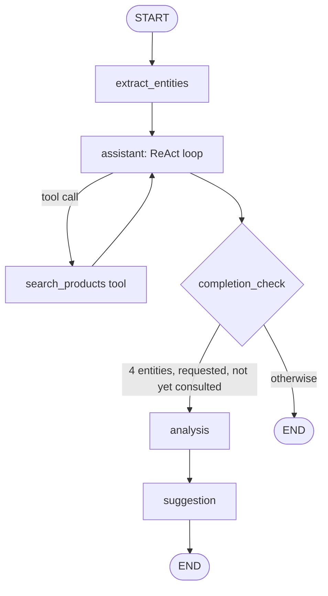

# Architecture — Flexible (Agentic)

This is one of two parallel chatbot architectures built for this task, to compare a scripted flow-based design against an LLM-driven agentic one. See `docs/ARCHITECTURE_RIGID.md` for the counterpart and `docs/DECISIONS.md` for why both are being built. Read `docs/DECISIONS.md` before this doc if something here seems arbitrary — it records the *why*, this records the *how*.

## Overview

Two capabilities are exposed through one flexible conversational graph: product search available at any point, and a business consultation flow that opportunistically collects 4 entities across turns and then automatically produces a free-knowledge analysis followed by a catalog-grounded suggestion.

Rather than classifying each turn into a rigid conversational bucket and branching to a narrow templated node, a single general-purpose LLM node stays in the driver's seat for every reply. Hardcoded, deterministic logic is reserved only for what the task requires without exception: once all 4 entities are known *and* the user has actually asked for (or agreed to) a consultation, analysis and suggestion must run, as two separate, isolated LLM calls. Entities becoming complete is not, by itself, a trigger — if all 4 are known but nothing has been requested yet, the assistant proactively offers to run the consultation instead of firing it unasked. Everything else — search, follow-ups on prior results, tangents, off-topic questions, corrections, unexpected input — is handled by that same flexible node, so the assistant can't get stuck in a dead end a misrouted classifier picked for it.

The graph is invoked once per user turn. Conversation state persists across turns via LangGraph's in-memory checkpointer, keyed by a session `thread_id` that lives for the lifetime of the CLI process (per the in-memory-only persistence decision).

## Shared infrastructure

Both architectures reuse the same product data pipeline and pluggable search strategies — they differ only in how the conversation itself is orchestrated. See `consultant_bot/common/` in the module layout below; full detail on the product pipeline and search strategy interface is in `ARCHITECTURE_RIGID.md` (identical for both variants) and summarized again here for a self-contained read.

## Module layout

```text
src/consultant_bot/
  __init__.py
  cli.py                   # REPL; --arch flexible|rigid picks which graph to build
  common/
    config.py               # model name/temperature, active search strategy, top_k
    entities.py              # shared Entities schema + ENTITY_FIELDS (business_type, customer_type, location, sales_channel)
    llm.py                   # shared build_chat_model() factory used by every LLM-touching node
    search/
      products.py             # loads + cleans products.json into Product records
      base.py                  # SearchStrategy protocol + ProductHit dataclass
      filter_search.py          # Phase 1: keyword/substring + category filter
      tfidf_search.py            # Phase 2: TF-IDF + cosine similarity
      embedding_search.py         # Phase 3: sentence-transformers semantic search
      eval.py                      # side-by-side comparison script across strategies
  flexible/
    __init__.py
    graph.py                 # builds and wires this variant's StateGraph
    state.py                  # this variant's State schema
    nodes/
      extract_entities.py      # always-on structured-output merge into state.entities + consultation_requested
      assistant.py               # tool-calling reply node; owns search_products; offers a consultation when entities are complete but unrequested
      completion_check.py         # plain-code gate: 4 entities present & requested & unconsulted?
      analysis.py                   # free-knowledge business analysis (no product data)
      suggestion.py                   # runs search, formats a grounded product suggestion
    tools/
      search_products.py            # LangChain tool wrapping the active SearchStrategy
  rigid/                      # see ARCHITECTURE_RIGID.md
tests/
  ...
```

## State schema

```python
class State(TypedDict):
    messages: Annotated[list[BaseMessage], add_messages]
    entities: Entities              # total=False: business_type, customer_type, location, sales_channel
    consultation_requested: bool     # user has explicitly asked for / agreed to a consultation
    consultation_offered: bool       # the proactive offer has already been made once since entities completed
    consultation_done: bool
    last_shown_products: list[ProductHit] | None
    remaining_steps: NotRequired[RemainingSteps]  # required by create_react_agent, see below
```

`messages` uses LangGraph's `add_messages` reducer so each turn appends rather than overwrites. The free-knowledge analysis text doesn't need its own state field — it's just another `AIMessage` in `messages` once produced.

`remaining_steps` is a LangGraph implementation detail, not part of the conceptual design: `create_react_agent` (used inside `assistant`, below) requires it to be present whenever a custom `state_schema` is passed, since it tracks the ReAct loop's remaining recursion budget internally.

`entities` merges field-by-field on every turn: a newly extracted value for a field replaces the old one (supports correcting earlier answers), fields not mentioned this turn are left untouched (supports collecting across turns in any order). Whenever `extract_entities` changes a field's value while `consultation_done` is `True`, it clears `consultation_done` back to `False`, so a post-suggestion correction ("actually I'm B2B, not B2C") automatically re-triggers a fresh analysis+suggestion on the next completion check instead of leaving stale advice standing.

`last_shown_products` is written by the `search_products` tool (and by `suggestion`) so follow-up turns ("what's the price of it?") can be answered directly from state instead of re-running search on an under-specified query.

`consultation_requested` is set `True` by `extract_entities` when the latest message (read with recent context) is an explicit ask for business advice/recommendations, or an affirmative reply to the assistant's own consultation offer — never set back to `False` once `True`, since a user who has entered the consultation flow shouldn't have to re-ask after a correction or a tangent. As with all context-dependent extraction in this design, an affirmative reply that arrives long after the offer, or amid an unrelated tangent, isn't guaranteed to resolve correctly — an accepted limitation, not a structural guarantee. `consultation_offered` exists purely to stop the assistant from repeating its proactive offer every turn once entities are complete and unrequested; it's set once, deterministically (by plain code, not an LLM judgment call) the first time the offer is actually delivered, and is never consulted again once `consultation_requested` becomes `True`.

## Graph topology



- **`extract_entities`** — unconditional structured-output LLM call (Pydantic schema matching `Entities`, all fields optional) against the latest user message plus recent context for pronoun/reference resolution. Only fills a field from an explicit, confident statement — a vague or non-committal reply ("not sure", "doesn't matter") is left unset rather than recorded, so `completion_check`'s presence test stays meaningful rather than being satisfiable by a non-answer. Merges into `state.entities` per the overwrite-on-new-mention rule above. Runs before the assistant replies so the assistant always sees up-to-date entity state, including anything just corrected.
- **`assistant`** — the conversational core: a tool-calling LLM node (LangGraph's prebuilt ReAct-style loop) with `search_products` as its only tool. Its system prompt is given the current entities and what's still missing, `consultation_requested`, `consultation_offered`, `consultation_done`, and `last_shown_products`. It replies to whatever the user actually said — general chat, a product query (calls the tool), a follow-up about a prior result (answers from `last_shown_products` already in context, no tool call needed), or an off-topic/unexpected message (answers helpfully and redirects if it fits naturally) — and may weave in a light prompt for a missing entity when appropriate, without that being forced or exclusive of answering what was actually asked.
  - **Compound requests** ("what products can I use for X, Y, and Z?") are explicitly called out in the system prompt: `search_products` takes one focused query at a time, and every strategy behind it ranks against a single combined query vector/string, so handing it the whole compound sentence in one call risks the facets that dominate the combined query crowding out the others from `top_k`. The prompt instructs decomposing a multi-part request into one `search_products` call per distinct need (optionally with `category` per facet) and synthesizing the results in the reply.
  - **Offers a consultation when entities are complete but unrequested.** If all 4 entities are present, `consultation_requested` is still `False`, `consultation_done` is `False`, and `consultation_offered` is also still `False`, the node's system prompt includes an explicit directive to proactively offer to run the analysis and product suggestion this turn, woven into whatever else it says. After the call, plain code (not the LLM) sets `consultation_offered = True` whenever that condition held this turn — so the offer is made exactly once per completion, not repeated on every subsequent turn while the user does something else. If the user accepts (or asks for it unprompted, in the same or a later turn), `extract_entities` picks that up as `consultation_requested = True` on its next pass and `completion_check` fires normally; if the user ignores or declines, the assistant simply stops mentioning it and answers normally, ready to fire immediately the moment interest is expressed.
  - **Must not pre-empt the dedicated analysis/suggestion pair.** The assistant can see when all 4 entities are present, and it has the search tool — nothing structurally stops it from giving its own business take and product picks in its normal reply the same turn the 4th entity lands, which would collide with (or duplicate) the dedicated nodes running right after and would bypass the required analysis/suggestion context isolation. The system prompt explicitly instructs it not to attempt analysis or recommendations itself once entities look complete — just acknowledge, and let the deterministic pipeline take over that same turn.
- **`completion_check`** — plain Python, no LLM call: all 4 `Entities` fields present, `consultation_requested`, and not `consultation_done`. (Not literally `all(entities.values())`: `Entities` is `total=False`, so an unset field is simply absent from the dict rather than present with a falsy value — `all()` over an empty/partial dict's values would vacuously pass. The real check tests each of the 4 known field names explicitly, via the shared `common.entities.ENTITY_FIELDS` tuple.) The one deterministic fork in the graph, guaranteeing the hard task requirement (4 entities + a request → analysis → suggestion) fires immediately and every time it's newly satisfied, regardless of what the assistant node was chatting about that turn. Entities alone are deliberately not enough — see the `assistant` bullet above for what happens while they're complete but unrequested.
- **`analysis`** — LLM call using **only** the 4 collected entities, no product data in context, and no general knowledge base. Built from a fresh, purpose-built prompt (system instructions + a synthetic summary of the 4 entities) on a plain, non-tool-bound LLM instance — deliberately **not** a continuation of `state["messages"]` and **not** the same tool-bound model object as `assistant`, so neither prior product search results sitting in the conversation history nor the search tool itself can leak into this call. This isolation is structural, not just a prompting convention, since it's a documented hard requirement.
- **`suggestion`** — two internal steps, both deterministic in sequence:
  1. **Query formulation** — a small LLM call turns the 4 entities plus the analysis text into a short, focused product-search query (and an optional category guess), rather than concatenating fields verbatim. This is the step that actually connects "business type / B2B-B2C / location / channel" to something a search strategy can usefully match against the catalog.
  2. **Retrieval + grounded formatting** — calls `search_products` directly (not through the assistant's tool loop) with that query, applies a minimum relevance threshold to the hits (strategy-appropriate: a non-zero match count for filter search, a cosine-similarity floor for TF-IDF/embeddings), and only then runs a second LLM call that formats a recommendation using *only* the hits that cleared the threshold (product names/prices/links passed in context, with an instruction not to invent products). If nothing clears the threshold, the LLM call is told to say so honestly rather than write up a forced, low-relevance list.

  Sets `consultation_done = True` and updates `last_shown_products` regardless of whether any hit cleared the threshold — the consultation itself is still considered complete.

Because `completion_check` runs after the assistant's own reply, whenever a single turn makes both conditions true at once — entities complete *and* `consultation_requested` — that turn produces *two* things appended to `messages` in one invocation: the assistant's normal reply to whatever they said, immediately followed by the analysis and suggestion messages. This can happen the moment the 4th entity lands, if that same message also asks for a consultation ("I'm in Tehran, and yes, let's do the consultation") — but more commonly the entity set completes first (triggering the proactive offer instead), and the request itself lands one or more turns later once the user responds to that offer, firing analysis+suggestion on *that* turn instead. Either way, once both conditions are true there's no waiting for any further confirmation step beyond the one the user themselves just gave.

## Product data pipeline

`common/search/products.py` loads `products.json` once at startup and normalizes each raw WooCommerce record into a small `Product` dataclass (`id`, `name`, `description`, `short_description` — HTML stripped to plain text — `categories`, `price`, `permalink`), dropping the ~50 other WooCommerce fields (`sku`, `stock_status`, `attributes`, `variations`, `_links`, etc.) that aren't needed for search relevance or LLM-facing summaries.

## Search strategy interface

```python
class SearchStrategy(Protocol):
    def search(self, query: str, category: str | None = None, top_k: int = 5) -> list[ProductHit]: ...

@dataclass
class ProductHit:
    product: Product
    score: float
```

Three interchangeable implementations (filter/keyword, TF-IDF, embeddings — see `ARCHITECTURE_RIGID.md` for the per-phase detail, identical here) live behind this protocol. `config.py` selects the active one; `flexible/tools/search_products.py` wraps it as a LangChain tool that also updates `state.last_shown_products`. `common/search/eval.py` runs a fixed set of realistic Persian queries — including a compound/multi-facet one issued as a single call, to show how each phase's single-query-vector ranking degrades on it standalone — against every implemented strategy side by side.

## CLI / session model

`cli.py` runs a REPL shared across both architectures, selecting which graph to build via an `--arch` flag (or equivalent):

1. Build the graph once, with an in-memory `MemorySaver` checkpointer.
2. Generate one `thread_id` for the process lifetime.
3. Loop: read a line from stdin → `graph.invoke(...)` → print the newly appended AI message(s) (there may be more than one per turn, per the immediate analysis+suggestion firing above) → repeat until EOF/`exit`.

No persistence beyond process lifetime.

## Configuration

`common/config.py`: `LLM_MODEL` (default `gpt-4o-mini`), `LLM_TEMPERATURE`, `SEARCH_STRATEGY` (`filter`|`tfidf`|`embedding`), `SEARCH_TOP_K`. `OPENAI_API_KEY` via environment, consumed by `langchain-openai` directly.

## Testing approach

- **Search strategies** — deterministic, no LLM; unit tests per phase against a fixture product list (shared with the rigid variant).
- **Entity merge logic** — accumulation across calls, overwrite-on-new-mention, clearing `consultation_done` on a post-completion change, `consultation_requested` staying sticky-`True` once set, `consultation_offered` being set exactly once by plain code when the offer condition is met.
- **`completion_check`** — trivial plain-function test, covering the new complete-but-unrequested and requested-but-incomplete cases alongside the original all-true/all-false ones.
- **`assistant`'s proactive-offer condition** — extracted as the pure `is_complete_but_unrequested_and_unoffered(state)` function specifically so it's unit-testable in isolation from the tool-calling loop around it.
- **`analysis`'s context isolation** — a fake LLM that records exactly what messages it was invoked with, asserting the call is always exactly a system message plus a 2-line entities summary, never `state["messages"]` or `last_shown_products`. Turns "isolation is structural" from a design claim into something a test actually checks.
- **`suggestion`'s threshold/retrieval logic** — a fake `SearchStrategy` and fake formatting LLM, asserting the formatter is never even called when nothing clears the relevance floor (the honest-fallback path), and that `consultation_done`/`last_shown_products` are set in both the found and nothing-found branches.
- **`assistant` node behavior** (tool-calling, decomposition, follow-ups, off-topic handling, not pre-empting analysis) and the query-formulation/formatting LLM calls inside `suggestion` aren't meaningfully unit-testable without a live/mocked LLM — exercised manually via the CLI demo.
- **End-to-end** — exercised manually via the CLI demo. (As of this writing, that manual pass is still pending in this environment for lack of an `OPENAI_API_KEY` — see `docs/TODO_FLEXIBLE.md`.)

## Comparison notes

This variant is the one designed to natively handle the scenarios worked through during design: follow-up questions about prior results, compound multi-facet search requests, off-topic or unexpected input, and mid-conversation entity corrections. The cost is more moving parts (a tool-calling loop, a query-formulation sub-step, prompt-engineered isolation guarantees that have to be gotten right rather than being structurally impossible to violate) and behavior that's harder to unit test without a live model. See `ARCHITECTURE_RIGID.md`'s "Known limitations" for the same scenarios traced through the simpler design, and `DECISIONS.md` for why both are being built rather than picking one.
