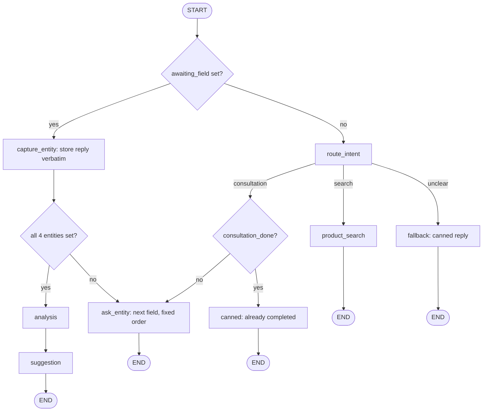

# Architecture — Rigid (Flow-Based)

This is one of two parallel chatbot architectures built for this task, to compare a scripted flow-based design against an LLM-driven agentic one. See `docs/ARCHITECTURE_FLEXIBLE.md` for the counterpart and `docs/DECISIONS.md` for why both are being built.

## Overview

This variant implements the task spec close to literally, as an explicit state machine: entities are collected one at a time, in the exact order the spec gives (business type → customer type → location → sales channel), by tracking exactly one "awaiting" field in state at a time. When a field is pending, the next user message is *always* taken as its literal answer — no intent classification, no reinterpretation. Product search and consultation are two distinct modes reached through a single per-turn intent classifier with a fixed branch each, and anything the classifier can't place lands in one canned fallback reply. LLM calls are used only where the task requires judgment (intent classification, the two consultation-analysis calls) — search formatting and entity capture are pure template/deterministic code, not LLM-authored.

This is intentionally the simpler, more predictable, more brittle of the two designs — the "control" baseline for the comparison. It favors verifiability (you can reason about exactly what state a conversation is in and what will happen next) over conversational naturalness.

The graph is invoked once per user turn, with state persisted via LangGraph's in-memory checkpointer keyed by a per-process `thread_id`, same as the flexible variant.

## Shared infrastructure

Both architectures reuse the same product data pipeline and pluggable search strategies — they differ only in how the conversation itself is orchestrated. See `consultant_bot/common/` below.

## Module layout

```text
src/consultant_bot/
  __init__.py
  architectures.py         # ARCHITECTURES registry: --arch flexible|rigid -> graph builder
  webui.py                 # Gradio RTL web UI (the only front end)
  common/
    analysis.py             # shared analysis prompt + analysis_messages(entities), used by
                             # both variants' analysis nodes
    config.py               # model name/temperature, active search strategy, top_k
    entities.py              # shared Entities model (business_type, customer_type, location, sales_channel)
    llm.py                   # shared build_chat_model() factory
    messages.py               # reply_texts() for the web UI, latest_user_text() for this variant's nodes
    search/
      products.py             # loads + cleans products.json into Product records
      base.py                  # SearchStrategy protocol + ProductHit + shared helpers (product_text,
                                # category_indices, search_with_category_fallback, format_hits)
      text.py                   # Persian normalization + stopword-aware keyword tokenization
      registry.py               # build_strategy()/build_active_strategy(); embedding imported lazily
      filter_search.py          # Phase 1: keyword/substring + category filter
      tfidf_search.py            # Phase 2: TF-IDF + cosine similarity
      embedding_search.py         # Phase 3: sentence-transformers semantic search
  rigid/
    __init__.py
    graph.py                 # build_graph() + assemble_graph() (the same wiring over injected
                              # LLM pieces/strategy, so tests can run the compiled graph on fakes)
    state.py                  # this variant's State schema, EntityField/Intent literals, Node protocol
    nodes/
      route_intent.py           # 3-way classifier: search | consultation | unclear
      capture_entity.py           # stores the raw reply verbatim into the pending field
      ask_entity.py                 # fixed question for the next field in the canonical order
      product_search.py               # template-formatted search, no LLM
      analysis.py                       # free-knowledge business analysis (no product data)
      suggestion.py                       # deterministic query + grounded LLM formatting
      canned.py                            # fallback + idle_reply: fixed canned replies
  flexible/                  # see ARCHITECTURE_FLEXIBLE.md
tests/
  ...
```

## State schema

```python
EntityField = Literal["business_type", "customer_type", "location", "sales_channel"]
Intent = Literal["search", "consultation", "unclear"]


class State(TypedDict):
    # Only `messages` is present from the first turn on; every other field appears once a node
    # first writes it, so nodes read them with `state.get(...)` (same convention as the flexible
    # variant's State).
    messages: Annotated[list[BaseMessage], add_messages]
    entities: NotRequired[Entities]            # the shared, frozen pydantic model; None = unknown
    awaiting_field: NotRequired[EntityField | None]  # which entity, if any, the next message answers
    intent: NotRequired[Intent | None]         # route_intent's label for this turn, read by its edge
    consultation_done: NotRequired[bool]
    last_search_results: NotRequired[list[ProductHit] | None]
```

`awaiting_field` is typed as a `Literal` of the 4 entity field names rather than a bare `str`, so a typo can't create a fifth pending field. There's no `analysis` field (unlike the flexible variant): the rigid `suggestion` builds its search query from the entities alone and never reads the analysis text back.

`awaiting_field` is the core mechanism of this design: it names exactly one of the 4 entity fields, or is `None`. Whenever it's set, the graph skips intent classification entirely and treats the incoming message as the literal answer to that field — including if the message was clearly meant as something else (e.g. "actually, can I search for products instead" while `location` is pending becomes the literal value stored for `location`). This is a deliberate, documented limitation of the rigid design, not an oversight — see "Known limitations" below.

## Graph topology



- **`route_intent`** — runs only when no field is pending. A single structured-output LLM call (`with_structured_output` over a model with one `Literal["search", "consultation", "unclear"]` field, the same pattern as the flexible variant's extractor) on the latest user message only. The node writes the label to `intent`; a pure routing function on the conditional edge reads it. No tool use, no free-form judgment beyond picking one label.
- **`capture_entity`** — zero LLM calls: takes the raw reply text, trims it, and stores it verbatim as the value of `awaiting_field`, then clears `awaiting_field`. No confidence check, no re-asking on an ambiguous answer — whatever was typed is the value. The one exception falls out of the entity model rather than a check: an empty reply leaves the field unset, so `ask_entity` asks for it again.
- **`ask_entity`** — zero LLM calls: looks up the first unset field in the fixed order (`business_type`, `customer_type`, `location`, `sales_channel`) and returns a fixed template question for it, setting `awaiting_field` to that field's name.
- **`product_search`** — zero LLM calls: passes the raw user message straight to the active `SearchStrategy.search()` as the query (no decomposition of compound requests, no query rewriting for follow-ups) and template-formats the top-`k` hits (name, price, link — the shared `format_hits` lines under a fixed header) into the reply, or a fixed "nothing found" message when there are none. `last_search_results` is updated for display purposes only — nothing downstream reads it back to resolve a later "what's the price of it?", since that would require the kind of context-dependent interpretation this design deliberately doesn't do outside the entity-capture flow.
- **`analysis`** — same hard requirement as the flexible variant: one LLM call using only the 4 collected entities, no product data, no knowledge base. Since this node is reached only through the fixed graph edges above rather than a shared/tool-bound conversational object, context isolation here falls out of the architecture directly rather than needing an explicit isolation rule.
- **`suggestion`** — two steps:
  1. **Query construction** — a fixed deterministic template (e.g. joining `business_type` and `sales_channel` into a short string), not an LLM call. Simpler than the flexible variant's LLM-driven query formulation, and correspondingly lower quality when the entities don't map cleanly onto catalog vocabulary.
  2. **Retrieval + formatting** — one `SearchStrategy.search()` call, `top_k` hits, then one LLM call that formats them (plus the entity summary, so the write-up addresses this business) into a recommendation grounded in that shortlist (same "don't invent products" instruction as the flexible variant). No relevance threshold — whatever `top_k` returns gets written up, even if none of it is a good match. Only when search returns no hits at all does it skip the LLM call and reply with a fixed "nothing found" message. Sets `consultation_done = True` and `last_search_results` either way.
- **`fallback`** (in `nodes/canned.py`) — zero LLM calls: one canned "I didn't quite get that — are you looking to search for products, or start a consultation?" message, regardless of what was actually said.
- **`idle_reply`** (in `nodes/canned.py`) — zero LLM calls: a canned message when `consultation_done` is already `True` and the user's message was classified as wanting to start a consultation again (no support for revisiting or restarting a completed consultation beyond this notice).

## Product data pipeline

Identical to the flexible variant: `common/search/products.py` loads `products.json` once and normalizes each record into a `Product` dataclass (`id`, `name`, `description`, `short_description`, `categories`, `price`, `permalink`), dropping the WooCommerce-specific fields not needed for search or display.

## Search strategy interface

```python
class SearchStrategy(Protocol):
    @property
    def relevance_threshold(self) -> float: ...  # noise floor on this strategy's own score scale
    def search(self, query: str, category: str | None = None, top_k: int = 5) -> list[ProductHit]: ...

@dataclass
class ProductHit:
    product: Product
    score: float
```

Same three phases as the flexible variant (filter/keyword, TF-IDF, embeddings), same protocol, same `config.py` selection, same `scripts/compare_search.py` comparison script — this part of the system doesn't differ between architectures.

## Web UI / session model

Shared `webui.py`, selecting this graph via `--arch rigid` (registered in `architectures.py`). Same in-memory checkpointer, per-browser-session `thread_id`, no persistence beyond process lifetime — identical to the flexible variant.

## Configuration

Same `common/config.py` as the flexible variant.

## Testing approach

- **Search strategies** — same deterministic unit tests, shared fixtures with the flexible variant.
- **`capture_entity` / `ask_entity` / route selection** — trivial plain-function tests against constructed `State` values; no LLM needed for anything except `route_intent`, `analysis`, and `suggestion`'s formatting call, which are tested with scripted fakes.
- **Multi-turn flow** — `tests/rigid/test_graph.py` runs whole conversations through the compiled graph (`assemble_graph` with a scripted classifier/LLM, the fixture-backed `FilterSearch` and the real checkpointer): the 4 questions in order, analysis + suggestion on the 4th answer, the idle reply afterwards, an off-topic reply swallowed by a pending field.
- **End-to-end** — a live-LLM pass (gpt-4o-mini, `filter` strategy) over the scenarios in "Known limitations" below plus the happy path, run by a script invoking the compiled graph the same way the web UI does. Every limitation showed up exactly as described. One thing worth knowing: because `product_search` passes the whole sentence as the query, the `filter` strategy's incidental single-word matches (e.g. "خدمات") dominate the ranking. A "site design" request listed Instagram page management first, ahead of the actual site-design products.

This variant is meaningfully easier to test without a live LLM than the flexible one, since most of the graph is plain deterministic code — a direct consequence of the design, not incidental.

## Known limitations

Traced through the same scenarios worked through while designing the flexible variant:

- **Follow-up questions about a prior result** ("what's the price of it?") — fail. `product_search` doesn't carry state forward for interpretation; the message is just run as a fresh, literal search query and won't match well.
- **Compound/multi-facet requests** ("what products for X, Y, and Z?") — degrade the same way a single search call does in the flexible variant's analysis, but with no decomposition step to mitigate it, since `product_search` never issues more than one search call per turn.
- **Off-topic or unexpected input** — always gets the same canned fallback (or, worse, gets silently absorbed as the literal value of whatever entity is pending), never a genuinely on-point reply. This is the sharpest contrast with the flexible variant's design goal.
- **Mid-conversation corrections** — only work if the field in question is the one currently pending. Once `capture_entity` has advanced past a field, there's no mechanism to revisit or correct it short of finishing or abandoning the whole consultation.
- **No relevance floor on suggestions** — same limitation the flexible variant explicitly fixes; here it's left as-is, consistent with this variant's "do the minimum the task requires, nothing adaptive" philosophy.

These aren't bugs to fix — they're the deliberate cost of this design's simplicity and predictability, and the point of building both variants is to make that trade-off concrete rather than argued in the abstract. See `ARCHITECTURE_FLEXIBLE.md` for how the other variant handles the same scenarios, and `DECISIONS.md` for the decision to build both.
