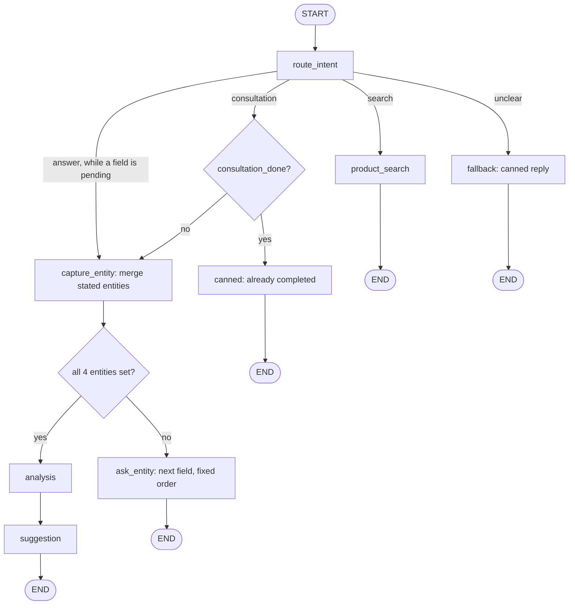

# Architecture — Scripted (Flow-Based)

This is one of two parallel chatbot architectures built for this task, to compare a scripted flow-based design against an LLM-driven agentic one. See `docs/ARCHITECTURE_AGENTIC.md` for the counterpart and `docs/DECISIONS.md` for why both are being built.

## Overview

This variant implements the task spec close to literally, as an explicit state machine: missing entities are asked for one at a time, in the exact order the spec gives (business type → customer type → location → sales channel), by tracking exactly one "awaiting" field in state at a time. Every turn goes through a single intent classifier with a fixed branch per label: an answer to the pending question, product search, consultation, or anything else, which lands in one canned fallback reply. The same call reports which entities the message states, so a consultation request that already gives some or all of them is only asked for the rest. LLM calls are used only where the task requires judgment (that classification call, the two consultation-analysis calls) — search formatting, questions and the entity merge are pure template/deterministic code, not LLM-authored.

This is intentionally the simpler, more predictable, more brittle of the two designs — the "control" baseline for the comparison. It favors verifiability (you can reason about exactly what state a conversation is in and what will happen next) over conversational naturalness.

The graph is invoked once per user turn, with state persisted via LangGraph's in-memory checkpointer keyed by a per-process `thread_id`, same as the agentic variant.

## Shared infrastructure

Both architectures reuse the same product data pipeline and pluggable search strategies — they differ only in how the conversation itself is orchestrated. See `consultant_bot/common/` below.

## Module layout

```text
src/consultant_bot/
  __init__.py
  architectures.py         # ARCHITECTURES registry: --arch agentic|scripted -> graph builder
  webui.py                 # Gradio RTL web UI (the only front end)
  common/
    analysis.py             # shared analysis prompt + analysis_messages(entities), used by
                             # both variants' analysis nodes
    config.py               # model name/temperature, active search strategy, top_k
    entities.py              # shared Entities model (business_type, customer_type, location, sales_channel)
    llm.py                   # shared build_chat_model() factory
    messages.py               # reply_texts() for the web UI, latest_user_text() for this variant's nodes
    search/
      products.py             # loads + cleans products.json into Product records
      base.py                  # SearchStrategy protocol + ProductHit + shared helpers (product_text,
                                # category_indices, search_relevant, format_hits)
      text.py                   # Persian normalization + stopword-aware keyword tokenization
      registry.py               # build_strategy()/build_active_strategy(); embedding imported lazily
      filter_search.py          # Phase 1: keyword/substring + category filter
      tfidf_search.py            # Phase 2: TF-IDF + cosine similarity
      embedding_search.py         # Phase 3: sentence-transformers semantic search
      hybrid_search.py             # TF-IDF and embedding scores blended (weighted sum)
  scripted/
    __init__.py
    graph.py                 # build_graph() + assemble_graph() (the same wiring over injected
                              # LLM pieces/strategy, so tests can run the compiled graph on fakes)
    state.py                  # this variant's State schema, EntityField/Intent literals, Node protocol
    nodes/
      route_intent.py           # classifier: answer | search | consultation | unclear + stated entities
      capture_entity.py           # merges stated entities into unset fields (verbatim fallback)
      ask_entity.py                 # fixed question for the next field in the canonical order
      product_search.py               # template-formatted search, no LLM
      analysis.py                       # free-knowledge business analysis (no product data)
      suggestion.py                       # deterministic query + grounded LLM formatting
      canned.py                            # fallback + idle_reply: fixed canned replies
  agentic/                  # see ARCHITECTURE_AGENTIC.md
tests/
  ...
```

## State schema

```python
EntityField = Literal["business_type", "customer_type", "location", "sales_channel"]
Intent = Literal["search", "consultation", "unclear"]


class State(TypedDict):
    # Only `messages` is present from the first turn on; every other field appears once a node
    # first writes it, so nodes read them with `state.get(...)` (same convention as the agentic
    # variant's State).
    messages: Annotated[list[BaseMessage], add_messages]
    entities: NotRequired[Entities]            # the shared, frozen pydantic model; None = unknown
    awaiting_field: NotRequired[EntityField | None]  # which entity's question is open, if any
    intent: NotRequired[Intent | None]         # route_intent's label for this turn, read by its edge
    stated_entities: NotRequired[Entities | None]  # entities route_intent found in this turn's message
    consultation_done: NotRequired[bool]
    last_search_results: NotRequired[list[ProductHit] | None]
```

`awaiting_field` is typed as a `Literal` of the 4 entity field names rather than a bare `str`, so a typo can't create a fifth pending field. There's no `analysis` field (unlike the agentic variant): the scripted `suggestion` builds its search query from the entities alone and never reads the analysis text back.

`awaiting_field` is the core mechanism of this design: it names exactly one of the 4 entity fields, or is `None`. While it's set, `route_intent` shows the classifier that field's question and offers it an extra `answer` label. A message labeled `answer` fills that field (with the value it states, or word for word if it states none). Any other label except `consultation` is handled as usual and leaves `awaiting_field` set, so the consultation resumes where it left off (e.g. "actually, can I search for products instead" while `location` is pending runs a search, and the reply ends by asking for the location again).

## Graph topology



- **`route_intent`** — runs on every turn. A single structured-output LLM call (`with_structured_output` over a model with one `Literal["answer", "search", "consultation", "unclear"]` field plus the 4 optional entity fields, the same pattern as the agentic variant's extractor) on the latest user message only. The entity fields hold whatever the message explicitly states about the user's own business ("یه کافه تو تهران دارم" → `business_type="کافه"`, `location="تهران"`), written to `stated_entities`; a placeholder like "null" counts as unset. `answer` is only described in the prompt while a field is pending, and the prompt then includes that field's question, since a bare "تهران" can't be classified without it. The node writes the label to `intent`; a pure routing function on the conditional edge reads it, and sends a stray `answer` with nothing pending to `fallback`. No tool use, no free-form judgment beyond one label and the stated values. `answer` and `consultation` (unless `consultation_done`) both go to `capture_entity`; the stated entities of a `search` or `unclear` turn are dropped, so "site design for a cafe" doesn't record the user's business type.
- **`capture_entity`** — reached on an `answer` or `consultation` label. Zero LLM calls: fills every still-unset field from `stated_entities` and clears `awaiting_field`. A field already set is never overwritten, since this variant has no correction mechanism. An `answer` that states no entity at all is stored verbatim (trimmed) as the pending field, so an answer the classifier couldn't pin to a field isn't lost; one that states only some *other* field leaves the pending one unset, and `ask_entity` asks it again, as it does after an empty reply. Then: all 4 known → `analysis`, else → `ask_entity`. The "all 4 known" branch also covers a consultation whose 4th answer was captured but whose analysis or suggestion call then failed (a timeout, a rate limit): the next consultation request goes straight to `analysis` and retries it.
- **`ask_entity`** — zero LLM calls: looks up the first unset field in the fixed order (`business_type`, `customer_type`, `location`, `sales_channel`) and returns a fixed template question for it, setting `awaiting_field` to that field's name. Fields the user already stated are skipped. A consultation request while a question is already open lands here too and simply repeats it.
- **`product_search`** — zero LLM calls: passes the raw user message straight to the active `SearchStrategy.search()` as the query (no decomposition of compound requests, no query rewriting for follow-ups) and template-formats the top-`k` hits (name, price, link — the shared `format_hits` lines under a fixed header) into the reply, or a fixed "nothing found" message when there are none. While an entity question is pending, the reply ends with that question again (`with_pending_reminder`), so the consultation picks up where it left off. `last_search_results` is updated for display purposes only — nothing downstream reads it back to resolve a later "what's the price of it?", since that would require the kind of context-dependent interpretation this design deliberately doesn't do outside the entity-capture flow.
- **`analysis`** — same hard requirement as the agentic variant: one LLM call using only the 4 collected entities, no product data, no knowledge base. Since this node is reached only through the fixed graph edges above rather than a shared/tool-bound conversational object, context isolation here falls out of the architecture directly rather than needing an explicit isolation rule.
- **`suggestion`** — two steps:
  1. **Query construction** — a fixed deterministic template (e.g. joining `business_type` and `sales_channel` into a short string), not an LLM call. Simpler than the agentic variant's LLM-driven query formulation, and correspondingly lower quality when the entities don't map cleanly onto catalog vocabulary.
  2. **Retrieval + formatting** — one `SearchStrategy.search()` call, `top_k` hits, then one LLM call that formats them (plus the entity summary, so the write-up addresses this business) into a recommendation grounded in that shortlist (same "don't invent products" instruction as the agentic variant). No relevance threshold — whatever `top_k` returns gets written up, even if none of it is a good match. Only when search returns no hits at all does it skip the LLM call and reply with a fixed "nothing found" message. Sets `consultation_done = True` and `last_search_results` either way.
- **`fallback`** (in `nodes/canned.py`) — zero LLM calls: one canned "I didn't quite get that — are you looking to search for products, or start a consultation?" message, regardless of what was actually said. While an entity question is pending it says "I didn't quite get that" and repeats that question instead.
- **`idle_reply`** (in `nodes/canned.py`) — zero LLM calls: a canned message when `consultation_done` is already `True` and the user's message was classified as wanting to start a consultation again (no support for revisiting or restarting a completed consultation beyond this notice).

## Product data pipeline

Identical to the agentic variant: `common/search/products.py` loads `products.json` once and normalizes each record into a `Product` dataclass (`id`, `name`, `description`, `short_description`, `categories`, `price`, `permalink`), dropping the WooCommerce-specific fields not needed for search or display.

## Search strategy interface

```python
class SearchStrategy(Protocol):
    @property
    def relevance_threshold(self) -> float: ...  # noise floor on this strategy's own score scale
    def search(self, query: str, category: str | None = None, top_k: int = 5) -> list[ProductHit]: ...

@dataclass
class ProductHit:
    product: Product
    score: float
```

Same three phases as the agentic variant (filter/keyword, TF-IDF, embeddings), plus the same `hybrid` blend of the last two, same protocol, same `config.py` selection, same `scripts/compare_search.py` comparison script — this part of the system doesn't differ between architectures.

## Web UI / session model

Shared `webui.py`, selecting this graph via `--arch scripted` (registered in `architectures.py`). Same in-memory checkpointer, per-browser-session `thread_id`, no persistence beyond process lifetime — identical to the agentic variant.

## Configuration

Same `common/config.py` as the agentic variant.

## Testing approach

- **Search strategies** — same deterministic unit tests, shared fixtures with the agentic variant.
- **`capture_entity` / `ask_entity` / route selection** — trivial plain-function tests against constructed `State` values; no LLM needed for anything except `route_intent`, `analysis`, and `suggestion`'s formatting call, which are tested with scripted fakes.
- **Multi-turn flow** — `tests/scripted/test_graph.py` runs whole conversations through the compiled graph (`assemble_graph` with a scripted classifier/LLM, the fixture-backed `FilterSearch` and the real checkpointer): the 4 questions in order, analysis + suggestion on the 4th answer, the idle reply afterwards, a search and an unclear message mid-consultation that leave the question open.
- **End-to-end** — a live-LLM pass (gpt-4o-mini, `filter` strategy) over the scenarios in "Known limitations" below plus the happy path, run by a script invoking the compiled graph the same way the web UI does. Every limitation showed up exactly as described. One thing worth knowing: because `product_search` passes the whole sentence as the query, the `filter` strategy's incidental single-word matches (e.g. "خدمات") dominate the ranking. A "site design" request listed Instagram page management first, ahead of the actual site-design products. After every turn was routed through `route_intent` (see `DECISIONS.md`), a second live pass covered the new routing: a full consultation with a search and a greeting in the middle. The detours were handled and the pending question stayed open. All 4 answers, one-word or full-sentence, were labeled `answer` and stored word for word, and the idle reply followed. A third pass, after `route_intent` began reporting stated entities: a consultation request giving all 4 in one message went straight to the analysis and suggestion; one giving 2 ("clothing store in Shiraz") was asked only for the other 2, around a search detour; "مردم عادی" was recorded as B2C.

This variant is meaningfully easier to test without a live LLM than the agentic one, since most of the graph is plain deterministic code — a direct consequence of the design, not incidental.

## Known limitations

Traced through the same scenarios worked through while designing the agentic variant:

- **Follow-up questions about a prior result** ("what's the price of it?") — fail. `product_search` doesn't carry state forward for interpretation; the message is just run as a fresh, literal search query and won't match well.
- **Compound/multi-facet requests** ("what products for X, Y, and Z?") — degrade the same way a single search call does in the agentic variant's analysis, but with no decomposition step to mitigate it, since `product_search` never issues more than one search call per turn.
- **Off-topic or unexpected input** — always gets the same canned fallback (repeating the pending question, if any), never a genuinely on-point reply. This is the sharpest contrast with the agentic variant's design goal. A detour is no longer saved as the pending entity (see the 2026-09-23 decision on classifying every turn), but a real answer the classifier mislabels gets its question asked again.
- **Entities count only on an answer or a consultation request** — ones mentioned in a search or a greeting are dropped, so a user who described their business in a search message is still asked about it later.
- **Mid-conversation corrections** — only work if the field in question is the one currently pending. Once `capture_entity` has advanced past a field, there's no mechanism to revisit or correct it short of finishing or abandoning the whole consultation.
- **No relevance floor on suggestions** — same limitation the agentic variant explicitly fixes; here it's left as-is, consistent with this variant's "do the minimum the task requires, nothing adaptive" philosophy.

These aren't bugs to fix — they're the deliberate cost of this design's simplicity and predictability, and the point of building both variants is to make that trade-off concrete rather than argued in the abstract. See `ARCHITECTURE_AGENTIC.md` for how the other variant handles the same scenarios, and `DECISIONS.md` for the decision to build both.
